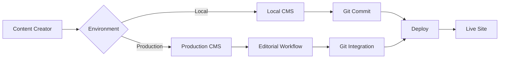

# Content Management Documentation

NetlifyCMS integration and content workflow documentation for the Hugo portfolio project.

## 📖 **Documentation Overview**

### 📋 **Implementation Status**
- **[CMS Implementation](cms-implementation.md)** - NetlifyCMS integration summary
  - Implementation status and features
  - Environment configuration
  - Quick start guide
  - Ready-to-use commands

### 📝 **Complete Usage Guide**
- **[CMS Usage Guide](cms-usage-guide.md)** - Comprehensive content management workflow
  - Detailed setup instructions for production and development
  - Content creation and editing workflows
  - Editorial workflow management
  - Cross-environment synchronization

---

## 🚀 **NetlifyCMS Features**

### **✅ Implemented**
- **Multi-Environment Support**: Local development + Production
- **Editorial Workflow**: Draft → Review → Publish
- **Content Types**: Portfolio projects, blog posts, site pages
- **Media Management**: Image uploads with organized storage
- **Authentication**: Netlify Identity integration
- **Git Integration**: All changes version controlled

### **📝 Content Management**
- **Portfolio Projects**: Complete project management with metadata
- **Blog Posts**: Full blog content with SEO fields
- **Site Pages**: Homepage, About, Contact editing
- **Media Library**: Organized image management
- **Categories & Tags**: Content taxonomy

---

## 🌍 **Environment Setup**

### **Production (Netlify)**
```
URL: https://isaiahdavis.com/admin/
Authentication: Netlify Identity
Backend: Git Gateway
Workflow: Editorial (Draft → Review → Publish)
```

### **Development (Local)**
```
URL: http://localhost:1313/admin/
Authentication: None required
Backend: Proxy server (netlify-cms-proxy-server)
Workflow: Simple (Direct publish)
```

---

## 🔄 **Content Workflow**



### **Cross-Environment Sync**
1. **Local Development**: Create/edit content using local CMS
2. **Git Integration**: Commit changes to repository
3. **Production Sync**: Pull changes or use production CMS
4. **Automatic Deploy**: Content changes trigger site rebuild

---

## 🛠️ **Quick Commands**

### **Development Setup**
```bash
# Full development environment
npm run dev:full          # Hugo + CSS + CMS

# CMS-focused development  
npm run dev:cms           # Hugo + CMS only

# Manual setup
hugo server -D            # Terminal 1: Hugo
npx netlify-cms-proxy-server  # Terminal 2: CMS
npm run watch            # Terminal 3: CSS (optional)
```

### **Access URLs**
```bash
# Local Development
Site: http://localhost:1313
CMS:  http://localhost:1313/admin/

# Production
Site: https://isaiahdavis.com
CMS:  https://isaiahdavis.com/admin/
```

---

## 📋 **Content Collections**

| Collection | Purpose | Fields | Features |
|------------|---------|--------|----------|
| **Portfolio** | Project showcase | Title, description, images, technologies, client | Gallery, metadata |
| **Blog Posts** | Article content | Title, content, author, SEO fields | Categories, tags, social |
| **Site Pages** | Static pages | Title, content, featured image | Homepage, about, contact |
| **Site Settings** | Configuration | Hugo config display | Read-only reference |

---

## 🔒 **Security & Authentication**

### **Production Security**
- **Netlify Identity**: Secure authentication system
- **Git Gateway**: Protected repository access
- **Invite-only**: Controlled user access
- **HTTPS**: Encrypted admin interface

### **Development Security**
- **Local proxy**: No external authentication
- **Local changes**: No production access required
- **Git-based**: Version controlled content
- **Environment isolation**: Safe development environment

---

## 📊 **Content Management Benefits**

### **For Content Creators**
- ✅ **Visual Interface**: No markdown knowledge required
- ✅ **Live Preview**: See changes before publishing
- ✅ **Media Management**: Easy image upload and organization
- ✅ **Editorial Workflow**: Draft/review/publish process

### **For Developers** 
- ✅ **Git Integration**: All content changes version controlled
- ✅ **Local Development**: Offline content management
- ✅ **Hot Reload**: Instant content updates during development
- ✅ **Automated Deployment**: Content changes trigger rebuilds

### **For Teams**
- ✅ **Collaboration**: Multiple editors with role-based access
- ✅ **Review Process**: Editorial workflow for quality control
- ✅ **Environment Parity**: Same content management across dev/prod
- ✅ **Backup**: Git-based content backup and history

---

*For technical implementation details, see [CMS Implementation Guide](cms-implementation.md).*  
*For complete setup and usage, see [CMS Usage Guide](cms-usage-guide.md).*