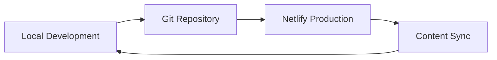

# NetlifyCMS Integration Guide

## Overview

NetlifyCMS is now fully integrated into your Hugo portfolio site, providing a powerful content management interface for both development and production environments. This implementation enables seamless content management across environments with shared backend integration.

## 🚀 Features Implemented

### ✅ Complete CMS Integration
- **Production**: Full Git Gateway integration with Netlify Identity
- **Development**: Local proxy server for offline content management
- **Editorial Workflow**: Draft → Review → Publish workflow
- **Environment Sync**: Content changes sync between dev and production

### ✅ Content Management
- **Portfolio Projects**: Full project management with images, metadata, and technologies
- **Blog Posts**: Complete blog content management with SEO fields
- **Site Pages**: Homepage, About, Contact, and Portfolio index pages
- **Site Settings**: Hugo configuration management (read-only display)

### ✅ Media Management
- **Image Uploads**: Organized in `static/images/uploads/`
- **Gallery Support**: Multiple images per portfolio project
- **Optimized Storage**: Ready for Netlify Large Media integration

## 🛠️ Environment Setup

### Production Environment (Netlify)

1. **Enable Netlify Identity**:
   - Go to your Netlify site dashboard
   - Navigate to **Identity** tab
   - Click **Enable Identity**

2. **Configure Git Gateway**:
   - In Identity settings, click **Settings and usage**
   - Scroll to **Git Gateway** section
   - Click **Enable Git Gateway**

3. **Set Registration Mode**:
   - In Identity settings, set **Registration** to **"Invite only"**
   - This prevents unauthorized access to your CMS

4. **Access Production CMS**:
   ```
   https://isaiahdavis.com/admin/
   ```

### Development Environment (Local)

1. **Install Dependencies**:
   ```bash
   npm install -g netlify-cms-proxy-server concurrently
   npm install concurrently --save-dev
   ```

2. **Start Development with CMS**:
   ```bash
   # Option 1: Full development environment (Hugo + CSS watch + CMS)
   npm run dev:full
   
   # Option 2: Hugo + CMS only
   npm run dev:cms
   
   # Option 3: Manual setup (3 separate terminals)
   hugo server -D                    # Terminal 1
   npm run watch                     # Terminal 2 (CSS)
   npx netlify-cms-proxy-server      # Terminal 3 (CMS)
   ```

3. **Access Local CMS**:
   ```
   http://localhost:1313/admin/
   ```

## 📝 Content Management Workflow

### Creating Portfolio Projects

1. Access CMS admin interface
2. Go to **"Portfolio Projects"** collection
3. Click **"New Portfolio Projects"**
4. Fill in required fields:
   - **Title**: Project name
   - **Description**: Project overview
   - **Year**: Project completion year
   - **Client**: Client name (optional)
   - **Technologies**: List of technologies used
   - **Featured Image**: Main project image
   - **Gallery Images**: Additional project screenshots
5. Write project details in **Body** (Markdown supported)
6. Save as draft or publish immediately

### Managing Blog Posts

1. Navigate to **"Blog Posts"** collection
2. Click **"New Blog Posts"**
3. Configure post metadata:
   - **Title** and **Description**
   - **Author** (defaults to "Isaiah Davis")
   - **Categories** and **Tags**
   - **SEO Keywords**
   - **Featured Image** and **Social Image**
4. Write content in **Body** field
5. Use editorial workflow: Draft → Review → Publish

### Editing Site Pages

1. Go to **"Site Pages"** collection
2. Select page to edit:
   - **Homepage**: Main landing page content
   - **About**: About page content
   - **Contact**: Contact page information
   - **Portfolio Index**: Portfolio section overview
3. Update content and metadata
4. Save changes

## 🔄 Environment Synchronization

### Content Flow Between Environments



### How Synchronization Works

1. **Local Development**:
   - Create/edit content using local CMS proxy
   - Changes saved directly to local Git repository
   - No authentication required

2. **Git Integration**:
   - Commit and push changes to remote repository
   - Production environment automatically rebuilds
   - Content becomes available on production site

3. **Production Management**:
   - Content creators use production CMS interface
   - Changes go through editorial workflow (if enabled)
   - Approved content automatically deploys

### Best Practices for Multi-Environment Content

1. **Development Content**:
   - Use for testing new content types
   - Experiment with layouts and formatting
   - Test image uploads and media handling

2. **Production Content**:
   - Final content publication
   - Client/team collaboration
   - Editorial workflow management

3. **Content Synchronization**:
   ```bash
   # Pull latest content from production
   git pull origin master
   
   # Push local changes to production
   git add .
   git commit -m "Update content"
   git push origin master
   ```

## 🔧 Configuration Details

### Backend Configuration

**Production (Git Gateway)**:
```yaml
backend:
  name: git-gateway
  branch: master
```

**Development (Proxy Server)**:
```yaml
backend:
  name: proxy
  proxy_url: http://localhost:8081/api/v1
  branch: master
```

### Media Configuration

```yaml
media_folder: "static/images/uploads"
public_folder: "/images/uploads"
```

### Editorial Workflow

```yaml
publish_mode: editorial_workflow
```

This enables:
- Draft state for new content
- Review process before publication
- Scheduled publishing options

## 🛡️ Security Configuration

### Netlify Identity Security

- **Registration**: Set to "Invite only"
- **Authentication**: Required for production CMS access
- **Git Gateway**: Secure Git operations through Netlify

### Headers Configuration

```toml
# NetlifyCMS Admin Interface Headers
[[headers]]
  for = "/admin/*"
  [headers.values]
    X-Frame-Options = "SAMEORIGIN"
    X-Content-Type-Options = "nosniff"
    X-XSS-Protection = "1; mode=block"
```

## 🚀 Deployment Integration

### Netlify Configuration

The CMS is integrated with your existing Netlify deployment pipeline:

```toml
# netlify.toml
[build]
  command = "npm run build:prod"
  publish = "public"

[context.production]
  command = "npm run build:prod"
  [context.production.environment]
    HUGO_ENV = "production"
```

### Automatic Deployment

1. **Content Changes**: Trigger automatic rebuilds
2. **Git Integration**: All changes version controlled
3. **Branch Deploys**: Different branches can have different content
4. **Preview Deploys**: PR previews include content changes

## 📱 Mobile Support

NetlifyCMS interface is fully responsive:
- **Mobile Editing**: Full content management on mobile devices
- **Touch Optimized**: Image uploads and form interactions
- **Offline Capability**: Draft content saved locally

## 🔍 Troubleshooting

### Common Issues

1. **CMS Not Loading**:
   - Check if Identity is enabled in Netlify
   - Verify Git Gateway is configured
   - Ensure branch name matches configuration

2. **Local Development Issues**:
   - Install proxy server: `npm install -g netlify-cms-proxy-server`
   - Start proxy server: `npx netlify-cms-proxy-server`
   - Check Hugo server is running on port 1313

3. **Authentication Problems**:
   - Verify Netlify Identity settings
   - Check registration mode (should be "Invite only")
   - Ensure correct site URL in CMS config

4. **Content Not Syncing**:
   - Check Git repository status
   - Verify branch names match
   - Ensure proper push permissions

### Support Commands

```bash
# Install CMS dependencies
npm install -g netlify-cms-proxy-server concurrently

# Full development environment
npm run dev:full

# CMS-only development
npm run dev:cms

# Manual proxy server start
npx netlify-cms-proxy-server

# Check Hugo server
hugo server -D --port=1313
```

## 🎯 Next Steps

1. **Team Onboarding**:
   - Invite team members through Netlify Identity
   - Provide CMS training and documentation
   - Set up content guidelines and workflows

2. **Content Migration**:
   - Import existing content through CMS interface
   - Optimize images for web delivery
   - Organize content with proper categories and tags

3. **Advanced Features**:
   - Configure Netlify Large Media for image optimization
   - Set up automated content backups
   - Implement custom preview templates

4. **Analytics Integration**:
   - Track content performance
   - Monitor editorial workflow efficiency
   - Analyze content engagement metrics

## 📚 Resources

- **NetlifyCMS Documentation**: https://www.netlifycms.org/docs/
- **Netlify Identity Guide**: https://docs.netlify.com/visitor-access/identity/
- **Git Gateway Documentation**: https://docs.netlify.com/visitor-access/git-gateway/
- **Hugo Content Management**: https://gohugo.io/content-management/

---

Your NetlifyCMS integration is now complete and ready for content management across both development and production environments! 🎉