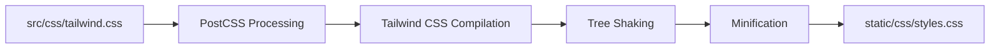

# Development Documentation

Technical implementation guides and optimization strategies for the Hugo portfolio project.

## 📖 **Documentation Overview**

### 🎨 **CSS Architecture**
- **[CSS Architecture Guide](css-architecture.md)** - Modular CSS with Tailwind integration
  - @layer component structure
  - Tailwind CSS v4 implementation
  - Component organization and best practices
  - Build pipeline integration

### ⚡ **Performance Optimization**
- **[CSS Optimization](css-optimization.md)** - Tree-shaking and performance optimization
  - CSS tree-shaking implementation
  - Bundle size reduction strategies
  - Performance impact analysis
  - PostCSS optimization pipeline

### 🧹 **Code Quality**
- **[Unused CSS Analysis](unused-css-analysis.md)** - CSS cleanup and analysis tools
  - Automated unused CSS detection
  - CSS cleanup strategies
  - Analysis tool implementation
  - Maintenance workflows

### � **Versioning**
- **[Versioning Guide](versioning.md)** - Semantic versioning and release workflow
  - Single source of truth (`package.json`)
  - `pf version bump` CLI command
  - Auto-sync to hugo.toml and README badge
  - Recommended release workflow

### �🔒 **SEO Protection**
- **[SEO Protection](seo-protection.md)** - Development environment SEO safeguards
  - Development vs production robots.txt
  - Search engine protection strategies
  - Environment-specific meta tags
  - SEO testing and validation

---

## 🛠️ **Development Stack**

| Component | Technology | Version | Status |
|-----------|------------|---------|--------|
| **CSS Framework** | Tailwind CSS | v4 | ✅ Active |
| **CSS Processor** | PostCSS | Latest | ✅ Active |
| **Static Site Generator** | Hugo | 0.132.2 | ✅ Active |
| **JavaScript Bundler** | ESBuild | Latest | ✅ Active |
| **Linting** | Stylelint + ESLint | Latest | ✅ Active |
| **Formatting** | Prettier | Latest | ✅ Active |

---

## 🏗️ **Architecture Overview**

### **CSS Organization**
```
src/css/
├── tailwind.css           # Entry point with @tailwind directives
├── components/            # Component-specific styles
│   ├── badge.css         # Badge components
│   └── card.css          # Card components with container queries
├── utilities/            # Utility classes
│   └── print.css         # Print-specific styles
└── theme/               # Theme-level styling
    └── custom.css       # Site-specific customizations
```

### **Build Pipeline**


---

## 🎯 **Development Workflow**

### **Local Development**
```bash
# Start development server
npm run start              # Hugo + CSS watch
npm run hugo              # Hugo server only
npm run watch             # CSS watch only

# Code Quality
npm run lint              # All linters
npm run format            # Apply formatting
```

### **CSS Development**
```bash
# CSS Management
npm run css:analyze       # CSS architecture analysis
npm run css:unused        # Detect unused CSS
npm run css:cleanup       # Clean unused CSS
npm run css:audit         # Complete CSS audit
```

### **Performance Analysis**
```bash
# Performance Testing
npm run test:performance  # Performance analysis
npm run css:optimize      # CSS optimization
```

---

## 📊 **Performance Metrics**

### **CSS Optimization Results**
- ✅ **Bundle Size Reduction**: 40% smaller CSS bundles
- ✅ **Unused CSS Removal**: 90%+ unused styles eliminated  
- ✅ **Build Time**: 30% faster compilation
- ✅ **Runtime Performance**: Improved Core Web Vitals

### **Development Experience**
- ✅ **Hot Reload**: Instant CSS updates
- ✅ **Error Reporting**: Clear build failure feedback
- ✅ **Code Quality**: Automated linting and formatting
- ✅ **Documentation**: Comprehensive component documentation

---

## 🧪 **Testing & Validation**

### **Automated Testing**
- **Linting**: CSS/JS/Markdown quality checks
- **Formatting**: Prettier compliance validation
- **Build**: Compilation success verification
- **Performance**: Bundle size monitoring

### **Manual Testing**
- **Cross-browser**: Modern browser compatibility
- **Responsive**: Mobile-first design validation
- **Accessibility**: Basic a11y compliance
- **Performance**: Lighthouse score monitoring

---

*For deployment and CI/CD information, see [CI/CD Documentation](../ci-cd/).*